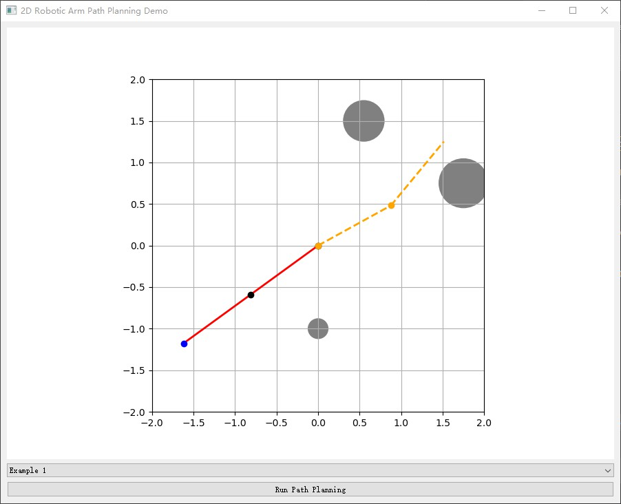
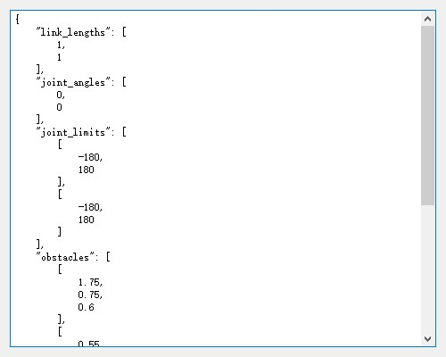
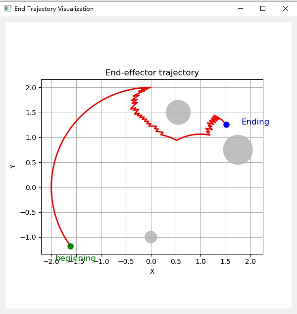
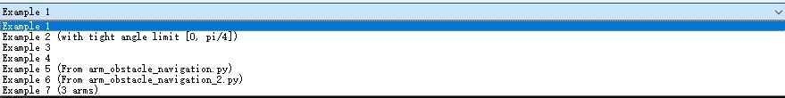

# 2D Robotic Arm Path Planning System


This project provides a graphical system for **2D robotic arm path planning**, generating obstacle-free trajectories for robotic arms with multiple links using the A* algorithm. Users can visualize arm trajectories, manage obstacles, and define custom test cases through YAML configuration files.


## Project Structure

- **planner** – Core path-planning logic (kinematics, collision detection, pathfinding)
- **tests** – Unit and integration tests for verifying system functionality
- **ui** – Graphical user interface components
- **examples.yml** – Predefined scenario configurations
- **main.py** – Application entry point


## Installation

Clone the repository, create a virtual environment, and install dependencies:

```bash
git clone https://github.com/FangZiyang/CAS741-Ryan.git
cd CAS741-Ryan
python -m venv env
# On Windows use: .\env\Scripts\activate
source env/bin/activate
cd src
pip install -r requirements.txt
```


## Usage

### Launching the Application

Run the main application interface:

```bash
python main.py
```

You will see the startup visualization:




## Interface Overview

The GUI provides the following functionality:

- **View Environment Configuration:** Displays parameters of the robotic arm, joint limits, obstacles, and initial conditions.



- **Trajectory Visualization:** Shows the path calculated for the robotic arm, clearly indicating the start and goal positions.



- **Scenario Selection:** Choose predefined test scenarios from the dropdown menu:




## Predefined Examples

Several scenarios are included by default. They illustrate common, edge-case, and complex path-planning situations:

| Scenario                | Description                                        | Expected Result        |
|-------------------------|----------------------------------------------------|------------------------|
| **Example 1**           | Standard obstacle avoidance                        | Success                |
| **Example 2**           | Joint limits violation at initial position         | Fail    (Joint limit)  |
| **Example 3**           | Standard obstacle avoidance                        | Success                |
| **Example 4**           | Collision at initial position                      | Fail    (Collision)    |
| **Example 5 & 6**       | Obstacle avoidance (from legacy scripts)           | Success                |
| **Example 7**           | Multi-joint arm obstacle avoidance                 | Success                |


## Creating Custom Examples

To define your own examples, modify the `examples.yml` file. Here’s a sample configuration:

```yaml
Example 1:
  link_lengths: [1, 1]
  joint_limits: [[-180, 180], [-180, 180]]
  obstacles:
    - [1.75, 0.75, 0.6]
    - [0.55, 1.5, 0.5]
    - [0, -1, 0.25]
  start: [10, 50]
  goal: [58, 56]
```

You can add additional examples following this structure.


## Testing

Run all unit tests:

```bash
pytest tests/ -v
```

Run tests with coverage:

```bash
pytest tests/ --cov=planner --cov-report=term-missing
```

### Static Code Checking
Code quality is enforced using `flake8`:

```bash
flake8 planner tests --max-line-length=100 --ignore=E203,W503
```


## Continuous Integration (CI)

This project employs **GitHub Actions** for automated testing and linting:

- All commits trigger automated unit tests.
- Python code style is checked using `flake8`.
- Coverage reports are automatically generated.

CI workflows are configured under `.github/workflows`.


## Uninstallation

If you installed this project using a **virtual environment**, uninstallation is simple:

### Remove the Virtual Environment

The entire environment—including all installed dependencies—is stored inside the `env/` folder. To uninstall:

<details>
<summary>Windows</summary>

```bash
rmdir /s /q env
```

</details>

<details>
<summary>macOS / Linux</summary>

```bash
rm -rf env
```

</details>

This will completely remove the environment and all packages (e.g., `matplotlib`, `PyQt5`, etc.) without affecting your system Python.


### Optional: Delete the Project

If you no longer need the project itself:

```bash
rm -rf CAS741-Ryan  # or use rmdir /s /q CAS741-Ryan on Windows
```


## Contributing

Your contributions (issues, pull requests, improvements) are warmly welcomed!


## License

This project is licensed under the **MIT License**. See `LICENSE` file for details.
