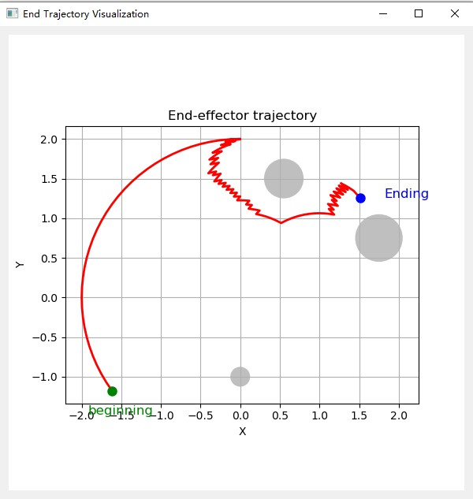
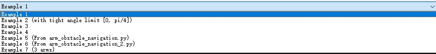

# User Manual: 2D Robotic Arm Path Planning System


## Table of Contents
- [Introduction](#introduction)
- [Installation](#installation)
- [Application Usage](#application-usage)
    - [Launching the Application](#launching-the-application)
    - [Interface Components](#interface-components)
- [Using Examples](#using-examples)
    - [Predefined Examples](#predefined-examples)
    - [Creating Custom Examples](#creating-custom-examples)
- [Running Tests](#running-tests)
- [Code Quality](#code-quality)
- [Continuous Integration](#continuous-integration)
- [Contributing](#contributing)


## Introduction

This system is a graphical tool designed for **2D robotic arm path planning**. It calculates collision-free paths for robotic arms using the A* pathfinding algorithm. Users can define robotic arm parameters, visualize planned trajectories, manage obstacle setups, and test multiple configurations easily.


## Installation

Follow these steps to install and set up the project:

```bash
git clone https://github.com/FangZiyang/CAS741-Ryan.git
cd CAS741-Ryan
python -m venv env
# On Windows use: .\env\Scripts\activate
source env/bin/activate
cd src
pip install -r requirements.txt
```


## Application Usage

### Launching the Application

Start the main graphical interface:

```bash
python main.py
```

On startup, you should see a visualization similar to the following:


### Interface Components

The interface allows interaction with several key elements:

**1. Environment Information:**

Displays robotic arm parameters, joint limits, and obstacle positions clearly:


**2. Trajectory Visualization:**

Shows the path computed by the algorithm, indicating starting positions, goal positions, and any obstacles:



**3. Scenario Selection:**

Predefined scenarios can be chosen easily through the dropdown menu:




## Using Examples

### Predefined Examples

The system includes predefined test scenarios. These scenarios help demonstrate typical situations, failure modes, and multiple-link configurations:

| Scenario      | Description                                  | Expected Result  |
|---------------|----------------------------------------------|------------------|
| **Example 1** | Standard obstacle avoidance                  | Success          |
| **Example 2** | Joint limits violation at initial position   | Fail (Joint limit) |
| **Example 3** | Standard obstacle avoidance                  | Success        |
| **Example 4** | Collision at initial position                | Fail (Collision) |
| **Examples 5 & 6** | Legacy scripts (standard avoidance)    | Success        |
| **Example 7** | Multi-joint arm obstacle avoidance           | Success        |


### Creating Custom Examples

To define your own custom scenarios, modify the `examples.yml` file. A simple example configuration looks like this:

```yaml
Example Custom:
  link_lengths: [1, 1]
  joint_limits: [[-180, 180], [-180, 180]]
  obstacles:
    - [1.5, 1.5, 0.5]
  start: [10, 20]
  goal: [50, 60]
```

You can add additional scenarios by copying and modifying this structure.


## Running Tests

To verify the system's integrity and functionality, use the provided test suite:

### Run all unit tests:

```bash
cd src
pytest tests/ -v
```

### Check test coverage:

```bash
pytest tests/ --cov=planner --cov-report=term-missing
```

This provides detailed insights into code coverage.


## Code Quality

Code quality and style guidelines are enforced with `flake8`. Run static code checks:

```bash
flake8 planner tests --max-line-length=100 --ignore=E203,W503
```

This helps maintain readable, clean, and maintainable code.


## Continuous Integration

This project uses **GitHub Actions** for continuous integration (CI):

- Automated testing runs with each commit.
- `flake8` checks maintain coding standards.
- Test coverage results are automatically generated and reviewed.

CI workflows are managed in the `.github/workflows` directory.


## Contributing

Your contributions—such as reporting bugs, suggesting improvements, and submitting pull requests—are encouraged. Feel free to open an issue or pull request to participate in enhancing this project.


## Understanding the Codebase & Making Modifications

This section describes the core classes and modules in the system to help users extend or modify its functionality.

| Module/Script               | Class/Function             | Purpose                                                                 |
|----------------------------|----------------------------|-------------------------------------------------------------------------|
| `planner/nlink_arm.py`     | `NLinkArm`                 | Represents the multi-link robotic arm. Handles kinematics and updates. |
|                            | `update_joints()`          | Updates joint angles and computes new link positions.                  |
|                            | `get_end_effector()`       | Returns current end-effector position.                                 |
|                            | `is_valid()`               | Checks whether arm configuration is valid.                             |
| `planner/collision.py`     | `detect_collision()`       | Checks for collision between an arm segment and a circular obstacle.   |
|                            | `get_occupancy_grid()`     | Generates a grid marking all invalid (colliding or out-of-limit) states. |
| `planner/astar_planner.py` | `astar_torus()`            | Performs A* pathfinding in the toroidal joint space.                   |
|                            | `find_neighbors_nd()`      | Gets neighbor configurations in N-dimensional grid.                    |
|                            | `calc_heuristic_map()`     | Computes heuristic for pathfinding (distance to goal).                 |
| `planner/joint_limits.py`  | `JointLimits`              | Manages and validates joint angle limits.                              |
| `ui/trajectory_plot.py`    | `TrajectoryPlotWindow`     | Displays animated trajectory of the end-effector.                      |
| `ui/example_info_window.py`| `ExampleInfoWindow`        | Shows joint limits, start/goal configuration, and obstacle setup.      |


### How to Modify the System

| Goal                              | What to Modify                                                 |
|-----------------------------------|----------------------------------------------------------------|
| Add more joints                   | Update `link_lengths` in example configuration. System is N-joint ready. |
| Change obstacle behavior          | Edit `obstacles` in `examples.yml`. Format: `[x, y, radius]`.   |
| Use different planner algorithm   | Replace `astar_torus()` in `planner/astar_planner.py`.         |
| Customize joint limits behavior   | Modify `JointLimits` logic in `planner/joint_limits.py`.        |
| Show new visualization types      | Edit plotting code in `ui/trajectory_plot.py`.                  |
| Add advanced input UI             | Enhance `main.py` and UI scripts under `ui/`.                   |


### Example: Adding a New Joint

To add a third joint, update your YAML:

```yaml
Example 3 Arms:
  link_lengths: [1, 1, 1]
  joint_angles: [0, 0, 0]
  joint_limits: [[-180, 180], [-180, 180], [-90, 90]]
  start: [10, 20, 30]
  goal: [60, 70, 10]
```

The system will automatically adjust to any number of joints.
